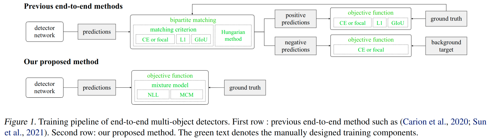
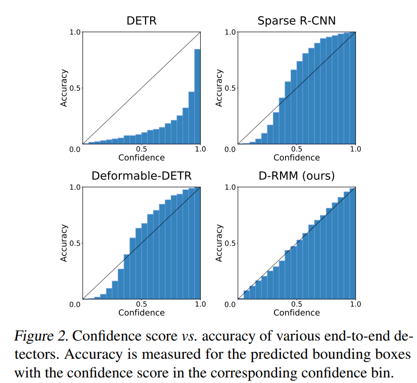

# [ICML 2023] End-to-End Multi-Object Detection with a Regularized Mixture Model

---
> [**End-to-End Multi-Object Detection with a Regularized Mixture Model**](https://arxiv.org/abs/2205.08714)<br>
> [Jaeyoung Yoo&ast;](https://scholar.google.com/citations?user=xQ2kWlYAAAAJ&hl=ko&oi=sra), [Hojun Lee&ast;](https://scholar.google.com/citations?user=1BOehSUAAAAJ&hl=ko&oi=sra), [Seunghyeon Seo
](https://scholar.google.com/citations?user=LL9u-5IAAAAJ&hl=ko&oi=sra), [Inseop Chung](https://scholar.google.com/citations?user=6bFY9FgAAAAJ&hl=ko&oi=sra), [Nojun Kwak](https://scholar.google.com/citations?user=h_8-1M0AAAAJ&hl=ko&oi=sra)<br>
> NAVER WEBTOON AI, Seoul National University <br>
>  &ast; equal contribution

Pytorch implementation for the ICML 2023 paper: End-to-end Multi-Object Detection with a Regularized Mixture Model.<br>
This paper aims to reduce the heuristics of the training process (Figure 1) and improve the reliability of the predicted confidence score (Figure 2). 





---

## Requirements
The codes are tested in the following environment:
- python 3.8
- pytorch 1.10
- CUDA 11.3
- mmdet 2.12.0
- mmcv-full 1.3.17


## Data Preparation
[exist_data_model.md](docs/1_exist_data_model.md)
```plain
D-RMM
├── mmdet
├── tools
├── configs
├── data
│   ├── coco
│   │   ├── annotations
│   │   ├── train2017
│   │   ├── val2017
│   │   ├── test2017
```


## Installation
[get_started.md](docs/get_started.md)
```
pip install torch==1.10.1+cu113 torchvision==0.11.2+cu113  -f https://download.pytorch.org/whl/cu113/torch_stable.html
pip install mmcv-full==1.3.17 -f https://download.openmmlab.com/mmcv/dist/cu113/torch1.10/index.html
python setup.py build develop
```

## Training & Test
```
bash train.sh
```

```
bash test.sh
```

---

## Performances
### Sparse R-CNN
|     Method     | Backbone  | AP val2017  | AP test-dev |                                               Config                                               |                                                 Link                                                  |
|:--------------:|:---------:|:-----------:|:-----------:|:--------------------------------------------------------------------------------------------------:|:-----------------------------------------------------------------------------------------------------:|
|     SRCNN      |    R50    |    45.0     |    45.2     | [config](./configs/sparse_rcnn/sparse_rcnn_r50_fpn_300_proposals_crop_mstrain_480-800_3x_coco.py)  |     [mmdet (reproduced)](https://github.com/open-mmlab/mmdetection/tree/main/configs/sparse_rcnn)     |
|     SRCNN      |   R101    |    46.4     |    46.4     | [config](./configs/sparse_rcnn/sparse_rcnn_r101_fpn_300_proposals_crop_mstrain_480-800_3x_coco.py) |     [mmdet (reproduced)](https://github.com/open-mmlab/mmdetection/tree/main/configs/sparse_rcnn)     |
|     SRCNN      | Swin-Tiny |    47.4     |      -      |                                                 -                                                  |                                                   -                                                   |
| D-RMM + SRCNN  |    R50    | 47.0 (+2.0) |    46.9     |                  [config](./configs/drmm/drmm_r50_fpn_syncbn_fullaug_3x_coco.py)                   | [Google Drive](https://drive.google.com/file/d/18nVIsM47uVkyJz0Nh9NemgudP7GnDOnB/view?usp=share_link) |
| D-RMM + SRCNN  |   R101    | 48.0 (+1.6) |    48.2     |                  [config](./configs/drmm/drmm_r101_fpn_syncbn_fullaug_3x_coco.py)                  | [Google Drive](https://drive.google.com/file/d/1gIYuwQl_TbpWCUx1xmMeRLr08BnZeYAE/view?usp=share_link) |
| D-RMM + SRCNN  | Swin-Tiny | 49.9 (+2.5) |      -      |                                                 TBA                                                  |                                                  TBA                                                    |

### AdaMixer
|      Method       | Backbone  | AP val2017  | AP test-dev | Config |                          Link                           |  
|:-----------------:|:---------:|:-----------:|:-----------:|:------:|:-------------------------------------------------------:|
 |     AdaMixer      |    R50    |    47.0     |    46.9     |   [Github](https://github.com/MCG-NJU/AdaMixer/blob/main/configs/adamixer/adamixer_r50_300_query_crop_mstrain_480-800_3x_coco.py)    | [Github](https://github.com/MCG-NJU/AdaMixer/tree/main) |    
|     AdaMixer      |   R101    |    48.0     |    48.2     |   [Github](https://github.com/MCG-NJU/AdaMixer/blob/main/configs/adamixer/adamixer_r101_300_query_crop_mstrain_480-800_3x_coco.py)    | [Github](https://github.com/MCG-NJU/AdaMixer/tree/main) | 
|     AdaMixer      | Swin-Tiny |    48.9     |      -      |   -    |                            -                            |
| D-RMM + AdaMixer  |    R50    | 48.4 (+1.4) | 48.7 (+1.8) |   TBA     |                           TBA                           |
| D-RMM + AdaMixer  |   R101    | 49.2 (+1.2) | 49.6 (+1.4) |   TBA     |                            TBA                            |
| D-RMM + AdaMixer  | Swin-Tiny | 50.7 (+1.8) |      -      |   TBA     |                            TBA                            |


---


## Citation
If you find this work or code useful for your research, please use the following BibTex entry:
```
@misc{yoo2023endtoend,
      title={End-to-End Multi-Object Detection with a Regularized Mixture Model}, 
      author={Jaeyoung Yoo and Hojun Lee and Seunghyeon Seo and Inseop Chung and Nojun Kwak},
      year={2023},
      eprint={2205.08714},
      archivePrefix={arXiv},
      primaryClass={cs.CV}
}
```


## Acknowledgment
- Our Codes are mainly originated from [MMDetection](https://github.com/open-mmlab/mmdetection)

## License
This project is released under the Apache 2.0 license.
See [LICENSE](/LICENSE) for the full license text.

```
D-RMM

Copyright 2022-present NAVER WEBTOON

Licensed under the Apache License, Version 2.0 (the "License");
you may not use this file except in compliance with the License.
You may obtain a copy of the License at

    http://www.apache.org/licenses/LICENSE-2.0

Unless required by applicable law or agreed to in writing, software
distributed under the License is distributed on an "AS IS" BASIS,
WITHOUT WARRANTIES OR CONDITIONS OF ANY KIND, either express or implied.
See the License for the specific language governing permissions and
limitations under the License.

```


<br>

